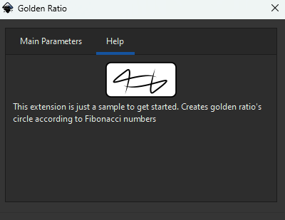

# Down the rabbit hole
In this part, we will explore the inx file (GUI design of your plugin).Since the documentation is very unclear of outdated, you seem to have to resort reading the source code. But hopefully, with this part you have some good references

# inx file
The main documentation seems to be this link which is helpful:
* [overview](https://inkscape.gitlab.io/extensions/documentation/authors/inx-overview.html)

Especially the DTD part explains you the potential configuration options. But for example it doesn't mentions labels, so you can not really see the options. Also weirdly enough it makes more sense to look at the rng tha tis the source for the dtd directly here
* [rng](https://gitlab.com/inkscape/extensions/-/blob/master/inkscape.extension.rng)

The most interesting bit is "inx.widget". These are things you use for describing the GUI mainly. For example, a label is not in the referenced dtd but you can see it defined here. You can also see that param has it own subsection. For example, there seems to be an attribute for label, appearance that can then be a header (presumably bigger) or an url.

```
 <define name="inx.widget">
    <choice>
      <element name="param">
        <ref name="inx.widget.common_attributes"/>
        <ref name="inx.parameter"/>
      </element>
      <element name="label">
        <ref name="inx.widget.common_attributes"/>
        <optional>
          <attribute name="appearance">
            <choice>
              <value>header</value>
              <value>url</value>
            </choice>
          </attribute>
        </optional>
        <optional>
          <attribute name="xml:space">
            <choice>
              <value>default</value>
              <value>preserve</value>
            </choice>
          </attribute>
        </optional>
        <text/>
      </element>

```

But of course to be sure we have to dig deeper in the source code. It seems widget are defined in the prefdialog codes here:
* [prefdialog folder](https://gitlab.com/inkscape/inkscape/-/tree/master/src/extension/prefdialog)

## Labels
In this folder you can find the label widget here
* [widget-label.cpp](https://gitlab.com/inkscape/inkscape/-/blob/master/src/extension/prefdialog/widget-label.cpp)

``` cpp
if (_appearance) {
        if (!strcmp(_appearance, "header")) {
            _mode = HEADER;
        } else if (!strcmp(_appearance, "url")) {
            _mode = URL;
        } else {
            g_warning("Invalid value ('%s') for appearance of label widget in extension '%s'",
                      _appearance, _extension->get_id());
        }
}
//.. a couple of 100 lines later
if (_mode == HEADER) {
        label->set_markup(Glib::ustring("<b>") + Glib::Markup::escape_text(newtext) + Glib::ustring("</b>"));
        label->set_margin_top(5);
        label->set_margin_bottom(5);
    } else if (_mode == URL) {
        Glib::ustring escaped_url = Glib::Markup::escape_text(newtext);
        label->set_markup(Glib::ustring::compose("<a href='%1'>%1</a>", escaped_url));
    } else {
        label->set_text(newtext);
    }

```

From this code we can see that there are 3 modi:
* header: This basically add bold tagging and adds margin to the top and bottom
* url: This create html a href link, so unexpected 
* default: Just set the text directly

Cool we basically documented labels!

## Images
If we scroll down in [rng](https://gitlab.com/inkscape/extensions/-/blob/master/inkscape.extension.rng), we can see that you can add images. 

```xml
<element name="image">
        <ref name="inx.widget.common_attributes"/>
        <optional>
          <attribute name="width">
            <data type="integer"/>
          </attribute>
          <attribute name="height">
            <data type="integer"/>
          </attribute>
        </optional>
        <text/>
</element>
```

I guess the parameters are as simple as
```xml
<image width="100" height="100"></image>
```

But what does it do? Let's look at the code again in prefdialog. Let's look at it's code
* [widget-image.cpp](https://gitlab.com/inkscape/inkscape/-/blob/master/src/extension/prefdialog/widget-image.cpp)

```cpp
if (xml->firstChild()) {
        content = xml->firstChild()->content();
    }
    if (content) {
        image_path = content;
    } else {
        g_warning("Missing path for image widget in extension '%s'.", _extension->get_id());
        return;
    }

    // make sure path is absolute (relative paths are relative to .inx file's location)
    if (!Glib::path_is_absolute(image_path)) {
        image_path = Glib::build_filename(_extension->get_base_directory(), image_path);
    }

```
Cool I guess that &lt;text/&gt; means there should be a link to an image. Preferablly absolute, and if not is pointing to the same. Let's update the help part with a logo
```xml
<page name="Help" gui-text="Help">
<image width="100" height="50">kitimo_logo.svg</image>
    <label xml:space="preserve">This extension is just a sample to get started. Creates golden ratio's circle according to Fibonacci numbers
    </label>
</page>
```

Now Let's drop kitimo_logo.svg in the same extension folder as the updated inx



Cool that seems to work as expected. Even surprised that it rendered the SVG correctly (basically real inception going on here)

## Params
Parameters are you input parameters. Personally think this is the most interesting. Let's dive into [rng](https://gitlab.com/inkscape/extensions/-/blob/master/inkscape.extension.rng) again

```xml
<choice>
      <group>
        <attribute name="type">
          <value>int</value>
        </attribute>
        <!--..-->
      </group>
      <group>
        <attribute name="type">
          <value>float</value>
        </attribute>
        <!--..-->
      </group>
      <group>
        <attribute name="type">
          <value>float</value>
        </attribute>
        <!--..-->
      </group>
      <group>
        <attribute name="type">
          <value>bool</value>
        </attribute>
        <ref name="data_type_boolean_strict"/>
      </group>
<!--..-->
</choice>
```

Ok so you can have a choice of parameters based on the attribute type (since it is not optional). So we can make a list of the following types supported
* int: number
* float: decimal
* bool: true false
* color: color selection
* string: text
* path: file or directory selector
* optiongroup: if you want the user to select for example a mode 
* notebook: seems to be how tabbing is made, notebook is the container, and page the body of that specific tab. I copied pasted this from the example and past it to the golden ratio script. I guess it allows you to detect which tab the user was watching at when he clicked apply

Since I won't document everything, I'll try to refer to the individual files here:
* [parameter-int.cpp)](https://gitlab.com/inkscape/inkscape/-/blob/master/src/extension/prefdialog/parameter-int.cpp)
* [parameter-float.cpp)](https://gitlab.com/inkscape/inkscape/-/blob/master/src/extension/prefdialog/parameter-float.cpp)
* [parameter-bool.cpp](https://gitlab.com/inkscape/inkscape/-/blob/master/src/extension/prefdialog/parameter-bool.cpp)
* [parameter-color.cpp](https://gitlab.com/inkscape/inkscape/-/blob/master/src/extension/prefdialog/parameter-color.cpp)
* [parameter-string.cpp)](https://gitlab.com/inkscape/inkscape/-/blob/master/src/extension/prefdialog/parameter-string.cpp)
* [parameter-path.cpp)](https://gitlab.com/inkscape/inkscape/-/blob/master/src/extension/prefdialog/parameter-path.cpp)
* [parameter-optiongroup.cpp)](https://gitlab.com/inkscape/inkscape/-/blob/master/src/extension/prefdialog/parameter-optiongroup.cpp)
* [parameter-notebook.cpp](https://gitlab.com/inkscape/inkscape/-/blob/master/src/extension/prefdialog/parameter-notebook.cpp)


### Common Attributes
First of all, every parameter has common attributes
```xml
 <define name="inx.widget">
    <choice>
      <element name="param">
        <ref name="inx.widget.common_attributes"/>
        <ref name="inx.parameter"/>
      </element>
<!--...-->

 <define name="inx.parameter.common_attributes">
    <attribute name="name">
      <data type="token"/>
    </attribute>
    <optional>
      <!-- TODO: gui-text is mandatory for visible parameters -->
      <attribute name="gui-text"/>
    </optional>
    <optional>
      <attribute name="gui-description"/>
    </optional>
  </define>
```

In all fairness it is quite self describing. Let's try gui-description
``` xml
<param name="max" type="int" min="2" max="50" gui-text="Number of circles" gui-description="The numbers of circle you want generated, basically how many fibonacci numbers you want to see expressed in circles" >8</param>
```

Nothing as exciting as seeing your description show up. I guess for this one, you don't need to dive into the code


### Int Parameter
For each type, it might be interesting to look at the other (optional) attributes. Let's start with Int since we have used it before
```xml
      <group>
        <attribute name="type">
          <value>int</value>
        </attribute>
        <optional>
          <attribute name="min">
            <data type="integer"/>
          </attribute>
        </optional>
        <optional>
          <attribute name="max">
            <data type="integer"/>
          </attribute>
        </optional>
        <optional>
          <attribute name="appearance">
            <value>full</value>
          </attribute>
        </optional>
        <choice>
          <empty/>
          <data type="integer"/>
        </choice>
      </group>
```

There a 3 attributes : Min, Max and appearance which can be full. Cool let's dive in the code to see what it means. For parameters you need to look for the specific type file so it seems. Here is the one for int:
* [parameter-int.cpp](https://gitlab.com/inkscape/inkscape/-/blob/master/src/extension/prefdialog/parameter-int.cpp)

Let's look at the appearance attribute

```cpp
if (_appearance) {
        if (!strcmp(_appearance, "full")) {
            _mode = FULL;
        } else {
            g_warning("Invalid value ('%s') for appearance of parameter '%s' in extension '%s'",
                      _appearance, _name, _extension->get_id());
        }
}
//...
if (_mode == FULL) {
        Glib::ustring text;
        if (_text != nullptr)
            text = _text;
        UI::Widget::SpinScale *scale = Gtk::manage(new UI::Widget::SpinScale(text, fadjust, 0));
        scale->set_size_request(400, -1);
        scale->show();
        hbox->pack_start(*scale, true, true);
} else if (_mode == DEFAULT) {
    Gtk::Label *label = Gtk::manage(new Gtk::Label(_text, Gtk::ALIGN_START));
    label->show();
    hbox->pack_start(*label, true, true);

    auto spin = Gtk::manage(new Inkscape::UI::Widget::SpinButton(fadjust, 1.0, 0));
    spin->show();
    hbox->pack_start(*spin, false, false);
}
```

Cool again 2 modi, FULL and default. Can't really make much from the code as it is referencing 3 things here:
* GTK label : GTK is Gimp toolkit, the GUI framework inkscape borrowed from GIMP, a photoshop alternative. No surprise they look alike
* UI::Widget::SpinScale which embeds the text in case of full
* UI::Widget::SpinButton which just shows a value. 
The last two seem manipulate fadjust so I guess that holds the actual in value. 

Ok let's just try full and see what the difference is
```xml
<param name="max" type="int" min="2" max="50"  appearance="full"   gui-text="Number of circles">8</param>
<param name="r"   type="int" min="1" max="100" appearance="full"  gui-text="R of circle 1">1</param>
<param name="l"   type="int" min="1" max="100" appearance="full"  gui-text="Line of circle">1</param>
```

The end result is a slider like input when you use full (SpinScale). Indeed, the text is embedded in the slider. If not full, there is text label and an input field (SpinButton) with up and down buttons included. Writing this up because this could be helpful if you see in other components. In fact, this is the case for [parameter-float](https://gitlab.com/inkscape/inkscape/-/blob/master/src/extension/prefdialog/parameter-float.cpp) type for example.


### Color Parameter
Let's look at color parameters
```xml
<group>
        <attribute name="type">
          <value>color</value>
        </attribute>
        <optional>
          <attribute name="appearance">
            <choice>
              <value>colorbutton</value>
            </choice>
          </attribute>
        </optional>
        <choice>
          <empty/>
          <data type="integer"/>
          <data type="string"/> <!-- TODO: We want to support unsigned integers in hex notation (e.g. 0x12345678),
                                           and possibly other representations valid for strtoul, not random strings -->
        </choice>
</group>
```

This one is documented quite good in the [official documentation](https://inkscape.gitlab.io/extensions/documentation/authors/inx-widgets.html#color). If you want to go crazy, you can dive into the code here [parameter-color.cpp](https://gitlab.com/inkscape/inkscape/-/blob/master/src/extension/prefdialog/parameter-color.cpp). I wouldn't recommend it though, it seems it is mostly converting a string 0x12345678 to a long int with strtoul. I don't even fully understand it cause I didn't dig to deep but I guess the gist is that you can take hex (0x) and then store it in a longint (32bits, 8 bits for r, 8 bits for g, 8 bits for b and finally 8 bits for alpha). You can do this easily by shifting bits with &gt;&gt; &amp; &lt;&lt; in cpp. Again, not required to go to deep here ;)

So I'm going to copy paste it
```xml
<param name="c" type="color" gui-text="Color for stroke">0x333333ff</param>
```
The parameters are quite self describing except for the choice part

Remember we also have to update the script to accept the parameter, even if we ignore it. According to the documentation, this should be a decimal but according to the [tutorial](https://inkscape.gitlab.io/extensions/documentation/tutorial/simple-path-extension.html) there is a separate type
```python
pars.add_argument("--c", type=inkex.Color, default=inkex.Color("red"))
```

I temporarily added the following code to the effect which basically prints the value to the svg
```python
textElement = TextElement()
textElement.text = str(self.options.c)
g.append(textElement)
```

That yielded 
```
#86b1d8
```
Which is basically the hex code of the color code I selected without the alpha. 

Ok so now we can change the style to use this color
```
s = Style.parse_str("fill:none;stroke:{1};stroke-width:{0};stroke-linejoin:round;paint-order:markers fill stroke;stop-color:#000000".format(self.options.l,str(self.options.c)))
```

What is interesting, if you want to know more about the inkex.Color class, we don't have to watch at the the c plus plus code but rather at the python inkex Color api. I'm not going to dive into it in this post, but will do so in the next. You can find the code here:
```
%programfiles%\Inkscape\share\inkscape\extensions\inkex\colors.py
```

I'm assuming that this python code in there is responsible for converting the object into a string when we converted it with str(self.options.c). It also means there are more elegant ways to assign color to an object.
```python
def __str__(self):
    """int array to #rrggbb"""
    # pylint: disable=consider-using-f-string
    if not self:
        return "none"
    if self.space == "named":
        rgbhex = "#{0:02x}{1:02x}{2:02x}".format(*self)
        if rgbhex in COLOR_SVG:
            return COLOR_SVG[rgbhex]
        self.space = "rgb"
    if self.space == "rgb":
        return "#{0:02x}{1:02x}{2:02x}".format(*self)
    if self.space == "rgba":
        if self[3] == 1.0:
            return "rgb({:g}, {:g}, {:g})".format(*self[:3])
        return "rgba({:g}, {:g}, {:g}, {:g})".format(*self)
    if self.space == "hsl":
        return "hsl({0:g}, {1:g}, {2:g})".format(*self)
    raise ColorError(f"Can't print colour space '{self.space}'")
```


# Main effect / extension code
The main code file for parsing the inx seems to be here:
* [effect.cpp](https://gitlab.com/inkscape/inkscape/-/blob/master/src/extension/effect.cpp)

There are interesting in there, for example on how the menu is build
```cpp
// Setting initial value of description to name of action incase if there is no description
Glib::ustring description  = get_name();
//...
//...
//...
if (!strcmp(effect_child->name(), INKSCAPE_EXTENSION_NS "menu-tip") ||
        !strcmp(effect_child->name(), INKSCAPE_EXTENSION_NS "_menu-tip")) {
    description = effect_child->firstChild()->content();
}
```

So basically the description will be the name, but if you set menu-tip, it will overwrite this. This seems trivial but is not documented anywhere


Finally here is a link to the general extension code file:
* [extension.cpp in general](https://gitlab.com/inkscape/inkscape/-/blob/master/src/extension/extension.cpp)

# End for this step
With all of this manipulations, the example has blown a bit out of propertions, so I'll stop here on editing the golden ratio example v1.